# Use case B : Building an Automated VOD-SR System with the Bluewhale AMI

## Architecture

## Prerequisites

To successfully follow this use case, you should have a basic understanding of the following AWS concepts:

1. EC2
2. IAM
3. AWS Systems Manager (SSM)
4. Amazom S3
5. AWS Lambda
6. AWS Step Functions
7. AWS Elemental MediaConvert
8. FFmpeg

## Workflow

## Step 1. Preparing the AWS Systems Manager Execution Environment

To remotely run FFmpeg on an EC2 instance based on the Bluewhale AMI, you must first configure an environment that allows AWS Systems Manager (SSM) to manage that instance. In this step, you will create the required IAM role, set the necessary permissions, and launch an EC2 instance using the Bluewhale AMI to establish the foundational infrastructure for automated VOD-SR processing.

#### 1. Creating an IAM Role (EC2-SSM-ROLE)

Create a dedicated IAM role that allows AWS Systems Manager (SSM) to manage your EC2 instance.

- Navigate to **IAM -> Roles -> Create role**
- **Trusted entitiy type** : AWS Service
- Select **Use case -> EC2**, then proceed to the next step
- Under **Permissions policies**, select **AmazonSSMManagedInstanceCore**
- Set the role name to "**EC2-SSM-ROLE**" and create the role

<br/>
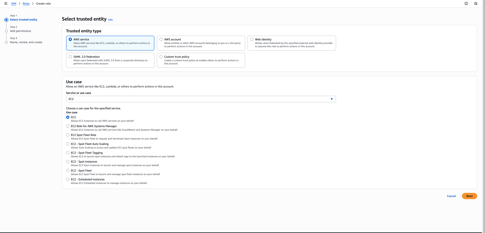
<br/>
<br/>
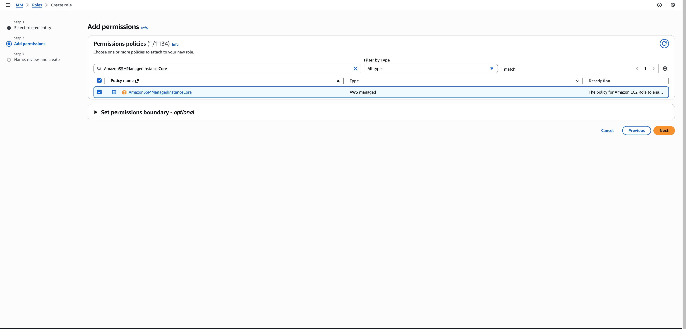
<br/>
<br/>
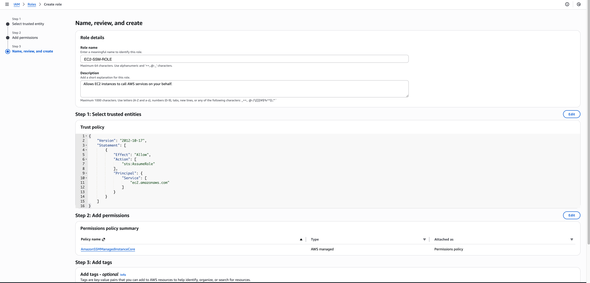
<br/>

#### 2. Adding an Inline Policy (EC2-SSM-POLICY)

Add additional permissions required for executing SSM Run Command.

- Go to **IAM → Roles → EC2-SSM-ROLE**
- Select **Add permissions → Create inline policy**
- In Policy editor, switch to the **JSON** tab and enter the following content:

  ```json
  {
    "Version": "2012-10-17",
    "Statement": [
      {
        "Effect": "Allow",
        "Action": [
          "ssm:SendCommand",
          "ssm:ListCommands",
          "ssm:ListCommandInvocations"
        ],
        "Resource": "*"
      }
    ]
  }
  ```

- Set Policy name to "**EC2-SSM-POLICY**" and create the policy

<br/>
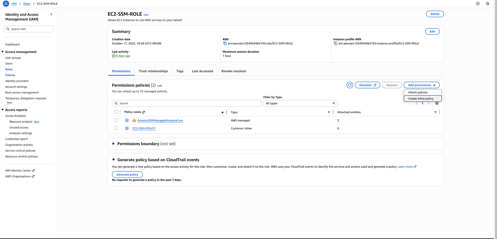
<br/>
<br/>
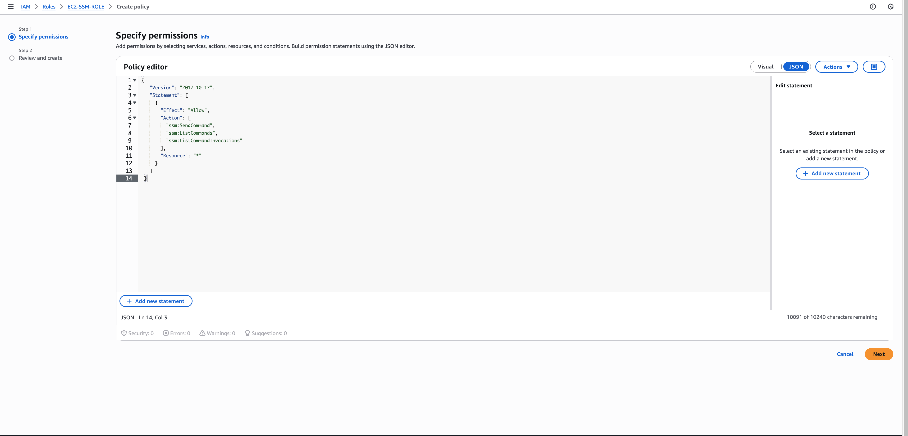
<br/>
<br/>
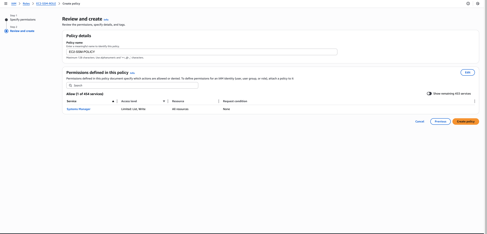
<br/>

#### 3. Launching an EC2 Instance with the Bluewhale AMI

Launch an EC2 instance based on the Bluewhale AMI and attach the IAM role created in the previous step, enabling the instance to be managed through SSM.

- Go to **EC2 → Launch instances**
- In the **Application and OS Images** search bar, enter _Bluewhale_
  - Select “Real-time AI Video Upscaling and Enhancement - Bluewhale (for Coupang)”
- Choose an instance type from the **g6e** family
- Under **Advanced details → IAM instance profile**, select **EC2-SSM-ROLE**
- Complete the remaining configuration and launch the instance
- After creation, note the **Instance ID** of the EC2 instance

<br/>
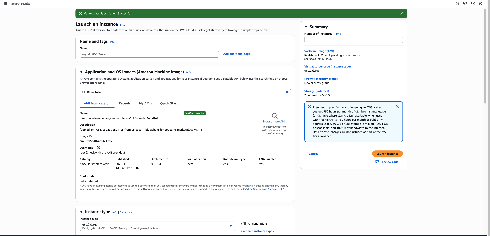
<br/>
<br/>
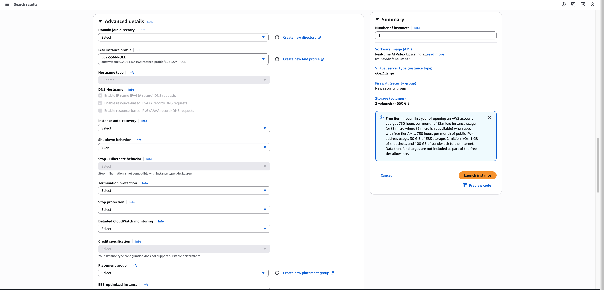
<br/>

## Step 2. Executing FFmpeg-Based SR Processing Using AWS Systems Manager Run Command

In this step, you will use the Run Command feature of AWS Systems Manager (SSM) to remotely execute super-resolution (SR) processing on an EC2 instance running the Bluewhale AMI.

#### 1. Running a Command to Install the AWS CLI

To upload or download files from Amazon S3 on the Bluewhale AMI–based EC2 instance, you must first install the AWS CLI.

- Navigate toe **AWS Systems Manager → Run Command → Run a command**
- For **Command document**, select AWS-RunShellScript
- Enter the following commands in the Command Parameters field:
  ```bash
  sudo apt update
  sudo apt install -y unzip curl
  curl "https://awscli.amazonaws.com/awscli-exe-linux-x86_64.zip" -o "awscliv2.zip"
  unzip awscliv2.zip
  sudo ./aws/install
  aws --version
  ```
- Under **Target selection → Choose instances manually**, select the EC2 Instance ID created in Step 1
- Click **Run**
- Review the installation results under **Targets and outputs**

<br/>
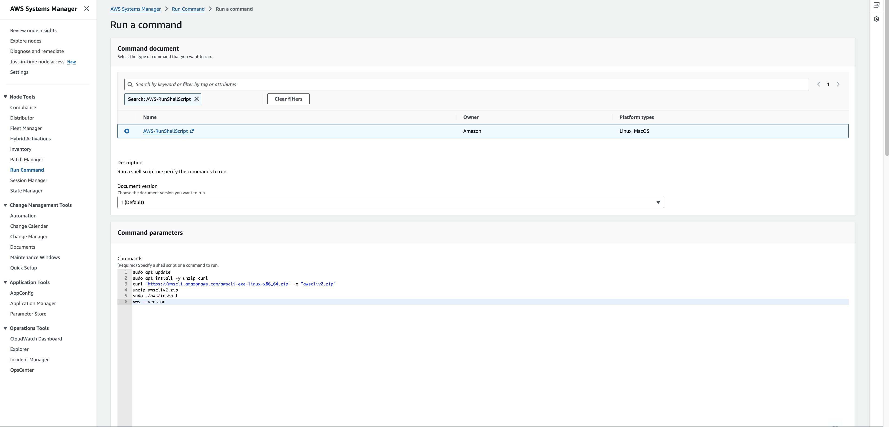
<br/>
<br/>
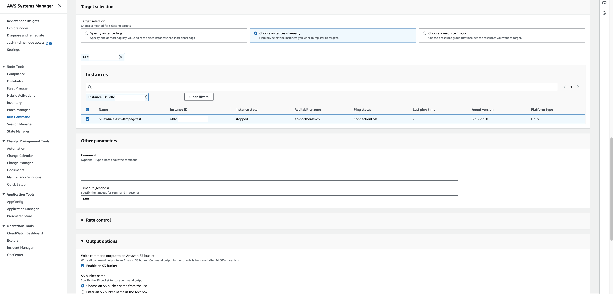
<br/>

#### 2. Running a Command to Execute FFmpeg-Based SR Processing

After installing the AWS CLI, you can use Run Command to automatically download the source file from S3, perform the SR (super-resolution) process, and upload the resulting file back to S3.

- Go to **AWS Systems Manager → Run Command → Run a command**
- For **Command document**, select AWS-RunShellScript
- In the Command Parameters field, enter one of the following :
  - Model A execution script
  - Model B execution scropt
- Execute Run Command
- Under **Targets and outputs → Instance ID**, review the command output

#### 2-1. Model A execution script

```bash
### set env-variables
export ONNX_DIR=/usr/local/bluedot/models/
export LD_LIBRARY_PATH=/usr/local/cuda/lib64:/usr/local/bluedot/:/usr/local/TensorRT/lib:$LD_LIBRARY_PATH
export PATH=/usr/local/bluedot:$PATH

export LD_LIBRARY_PATH=/etc/neura-vortex/nvx_packages/plugins/libs:$LD_LIBRARY_PATH
export PYTHONPATH=/etc/neura-vortex/libs/python3.10/site-packages
export VSSCRIPT_PATH=/etc/neura-vortex/nvx_packages/plugins/scripts
export VSPREFIX=/etc/neura-vortex
export PATH=$PATH:/etc/neura-vortex/bin
export VAPOURSYNTH_CONF_PATH=/etc/neura-vortex/vapoursynth.conf

### s3 access key
export AWS_ACCESS_KEY_ID=your_access_key_id
export AWS_SECRET_ACCESS_KEY=your_secret_access_key
export AWS_DEFAULT_REGION=ap-northeast-2

### orig bucket and original filename
ORIG_BUCKET='bluewhale-ami-sample'
ORIG_FILENAME='original_640x480_10s.mp4'

### sr bucket and sr filename
SR_BUCKET='bluewhale-ami-sample-sr'
SR_FILENAME='sr_1280x960_10s.mp4'

### change working directory
cd /root

### original_file : download from s3
aws s3 cp s3://${ORIG_BUCKET}/${ORIG_FILENAME} ./${ORIG_FILENAME}

### ffmpeg : original_file -> SR -> sr_file (Model A)
ffmpeg -y -i ${ORIG_FILENAME} -vf bdnvx_aws,bdsr_coupang_aws,noise=c0s=8:allf=t+u -c:v h264_nvenc -cq 13 -c:a copy ${SR_FILENAME}

### sr_file : upload to s3
aws s3 cp ./${SR_FILENAME} s3://${SR_BUCKET}/${SR_FILENAME}
```

#### 2-2. Model B execution script

```bash
### set env-variables
export ONNX_DIR=/usr/local/bluedot/models/
export LD_LIBRARY_PATH=/usr/local/cuda/lib64:/usr/local/bluedot/:/usr/local/TensorRT/lib:$LD_LIBRARY_PATH
export PATH=/usr/local/bluedot:$PATH

export LD_LIBRARY_PATH=/etc/neura-vortex/nvx_packages/plugins/libs:$LD_LIBRARY_PATH
export PYTHONPATH=/etc/neura-vortex/libs/python3.10/site-packages
export VSSCRIPT_PATH=/etc/neura-vortex/nvx_packages/plugins/scripts
export VSPREFIX=/etc/neura-vortex
export PATH=$PATH:/etc/neura-vortex/bin
export VAPOURSYNTH_CONF_PATH=/etc/neura-vortex/vapoursynth.conf

### s3 access key
export AWS_ACCESS_KEY_ID=your_access_key_id
export AWS_SECRET_ACCESS_KEY=your_secret_access_key
export AWS_DEFAULT_REGION=ap-northeast-2

### orig bucket and original filename
ORIG_BUCKET='bluewhale-ami-sample'
ORIG_FILENAME='original_640x480_10s.mp4'

### sr bucket and sr filename
SR_BUCKET='bluewhale-ami-sample-sr'
SR_FILENAME='sr_1280x960_10s.mp4'

### change working directory
cd /root

### original_file : download from s3
aws s3 cp s3://${ORIG_BUCKET}/${ORIG_FILENAME} ./${ORIG_FILENAME}

### ffmpeg : original_file -> SR -> sr_file (Model B)
ffmpeg -y -i ${ORIG_FILENAME} -vf bdsr_coupang_aws -c:v h264_nvenc -cq 13 -c:a copy ${SR_FILENAME}

### sr_file : upload to s3
aws s3 cp ./${SR_FILENAME} s3://${SR_BUCKET}/${SR_FILENAME}
```

#### 2-3. Description of Script Variables

| Variable NAme         | Description                                             |
| --------------------- | ------------------------------------------------------- |
| AWS_ACCESS_KEY_ID     | Access key used for uploading/downloading files from S3 |
| AWS_SECRET_ACCESS_KEY | Secret key used for uploading/downloading files from S3 |
| ORIG_BUCKET           | S3 bucket containing the source file                    |
| ORIG_FILENAME         | Name of the source file                                 |
| SR_BUCKET SR          | S3 bucket for uploading the SR output file              |
| SR_FILENAME           | Name of the generated SR file                           |

<br/>
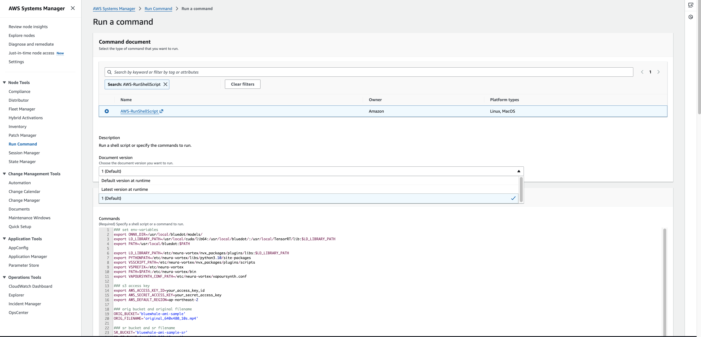
<br/>
<br/>
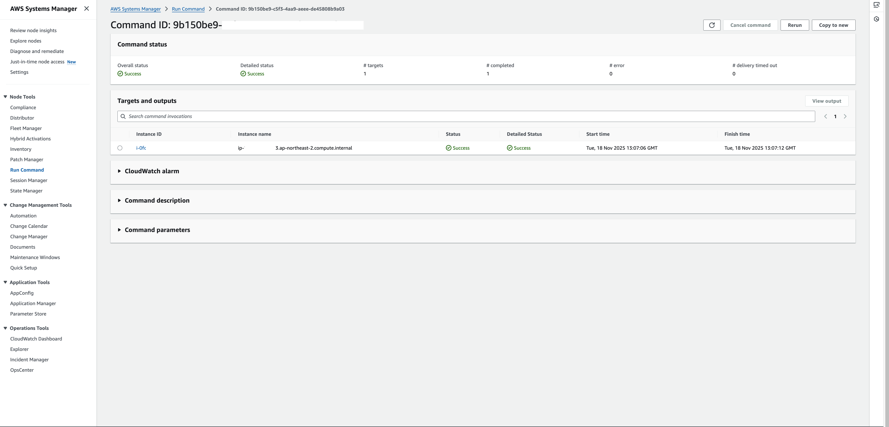
<br/>
<br/>
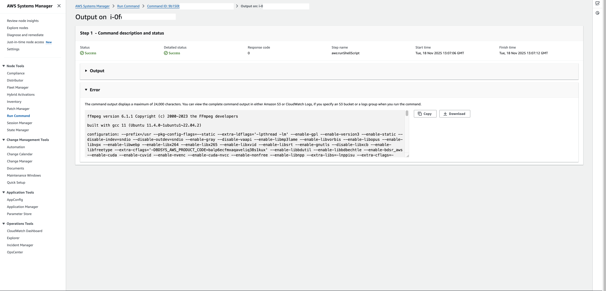
<br/>

## Step 3. Building a MediaConvert Pipeline Triggered by S3 Upload Events

In this step, you will configure an automated pipeline that generates HLS output for SR-processed files. When a new SR result is uploaded to a designated S3 bucket, the pipeline is triggered and executed through AWS Lambda → Step Functions → AWS Systems Manager → AWS MediaConvert.

The overall workflow is as follows:

1. Upload a source file to the S3 bucket
2. Lambda trigger is invoked
3. Step Functions workflow starts
4. Step Functions executes FFmpeg SR processing on EC2 via SSM Run Command
5. Once SR processing is complete, MediaConvert is executed
6. HLS output is generated

### 1. Configuring the IAM Role (Permissions for Lambda, Step Functions, SSM, and MediaConvert)

Create an integrated IAM role that grants the necessary permissions for executing Lambda, Step Functions, SSM Run Command, and MediaConvert within the automated pipeline.

### 1-1. Setting the Permissions Policy

Create a new policy under **IAM → Roles** and apply the following JSON:

```json
{
  "Version": "2012-10-17",
  "Statement": [
    {
      "Effect": "Allow",
      "Action": ["s3:GetObject"],
      "Resource": [
        "arn:aws:s3:::becthle-vod-test-input/*",
        "arn:aws:s3:::bluewhale-ami-sample/*"
      ]
    },
    {
      "Effect": "Allow",
      "Action": [
        "ssm:SendCommand",
        "ssm:ListCommands",
        "ssm:ListCommandInvocations",
        "ssm:GetCommandInvocation",
        "states:*"
      ],
      "Resource": "*"
    },
    {
      "Effect": "Allow",
      "Action": ["ec2:DescribeInstances"],
      "Resource": "*"
    },
    {
      "Effect": "Allow",
      "Action": [
        "mediaconvert:CreateJob",
        "mediaconvert:CancelJob",
        "mediaconvert:GetJob",
        "mediaconvert:ListJobs",
        "mediaconvert:DescribeEndpoints",
        "iam:PassRole"
      ],
      "Resource": "*"
    },
    {
      "Effect": "Allow",
      "Action": [
        "logs:CreateLogGroup",
        "logs:CreateLogStream",
        "logs:PutLogEvents"
      ],
      "Resource": "*"
    },
    {
      "Sid": "Statement1",
      "Effect": "Allow",
      "Action": ["states:*"],
      "Resource": "*"
    },
    {
      "Sid": "AllowStepFunctionsEventBridgeManagedRule",
      "Effect": "Allow",
      "Action": [
        "events:PutRule",
        "events:PutTargets",
        "events:DescribeRule",
        "events:DeleteRule",
        "events:RemoveTargets"
      ],
      "Resource": "*"
    }
  ]
}
```

<br/>
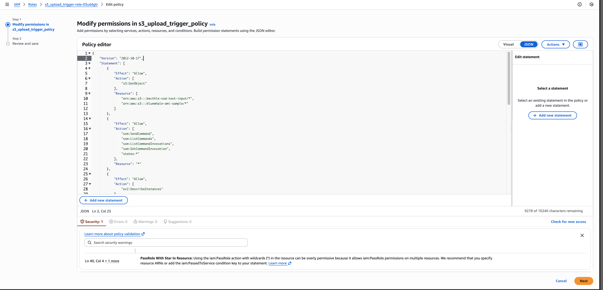
<br/>

### 1-2. Configuring the Trust Relationship

Specify the AWS services that are allowed to assume this role:

```json
{
  "Version": "2012-10-17",
  "Statement": [
    {
      "Effect": "Allow",
      "Principal": {
        "Service": [
          "states.ap-northeast-2.amazonaws.com",
          "lambda.amazonaws.com",
          "states.amazonaws.com"
        ]
      },
      "Action": "sts:AssumeRole"
    }
  ]
}
```

<br/>
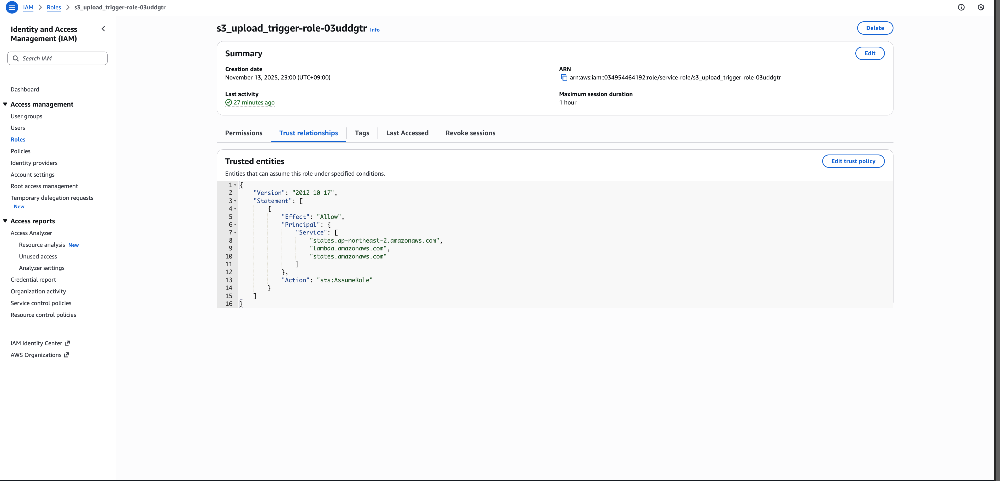
<br/>

### 2. Configuring the Lambda Trigger for S3 Upload Events

Create a Lambda function that detects newly uploaded source files and triggers the Step Functions workflow.

### 2-1. Creating the Lambda Function

- **Navigate to Lambda → Create function**
- Select **Author from scratch**
- Function name: **s3_upload_sr_trigger**
- Runtime: **Node.js 22.x**
- Execution role: **Use an existing role → s3_upload_trigger-role-03uddgtr**

<br/>
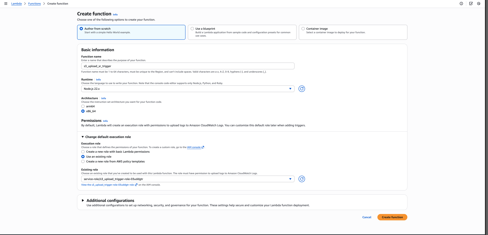
<br/>

### 2-2. Connecting the S3 Trigger

- **Go to Lambda → Function overview → Add trigger**
- Trigger type: S3
- Bucket: Select the source file bucket where the trigger will be applied
- Event type: **All object create events**
- Save the configuration
- After configuration, verify that the Lambda trigger is registered under
  **S3 → Properties → Event notifications**

<br/>
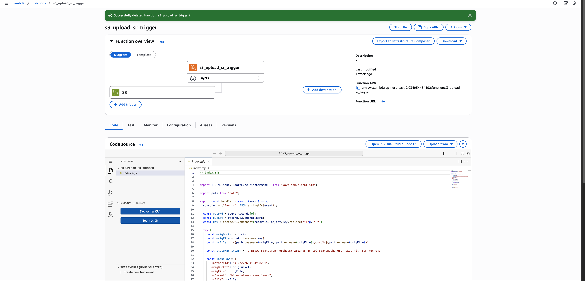
<br/>
<br/>
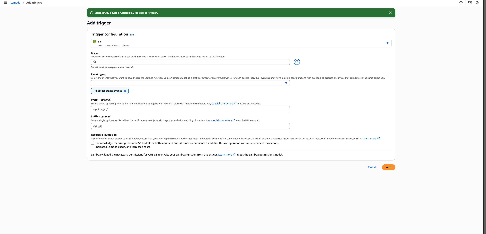
<br/>

### 2-3. Writing the Step Functions Execution Code in Lambda

In the Lambda console, go to the **Code** tab and add the following code:

```js
// index.mjs
import { SFNClient, StartExecutionCommand } from '@aws-sdk/client-sfn';
import path from 'path';

export const handler = async event => {
  console.log('Event:', JSON.stringify(event));

  const record = event.Records[0];
  const bucket = record.s3.bucket.name;
  const key = decodeURIComponent(record.s3.object.key.replace(/\+/g, ' '));

  try {
    const origBucket = bucket;
    const origFile = path.basename(key);
    const srFile = `${path.basename(
      origFile,
      path.extname(origFile),
    )}_sr_2x${path.extname(origFile)}`;

    const stateMachineArn =
      'arn:aws:states:ap-northeast-2:034954464192:stateMachine:sr_exec_with_ssm_run_cmd';

    const inputRaw = {
      instanceId: 'i-0fc7eb64184f98251',
      origBucket,
      origFile,
      srBucket: 'bluewhale-ami-sample-sr',
      srFile,
    };

    const input = JSON.stringify(inputRaw);
    console.log('step function input:', inputRaw);

    const command = new StartExecutionCommand({
      stateMachineArn,
      input,
    });

    const sfnClient = new SFNClient({ region: record.awsRegion });
    const response = await sfnClient.send(command);

    console.log('Step Function success:', response);

    return {
      statusCode: 200,
      body: JSON.stringify({
        message: 'Step Function started',
        executionArn: response.executionArn,
      }),
    };
  } catch (error) {
    console.error('Step Function fail:', error);

    return {
      statusCode: 500,
      body: JSON.stringify({
        error: 'Failed to start Step Function',
        details: error.message,
      }),
    };
  }
};
```

### 2-4. Lambda Function Execution Verification

Go to **Lambda → Monitor → CloudWatch Logs** to verify the execution logs.

<br/>
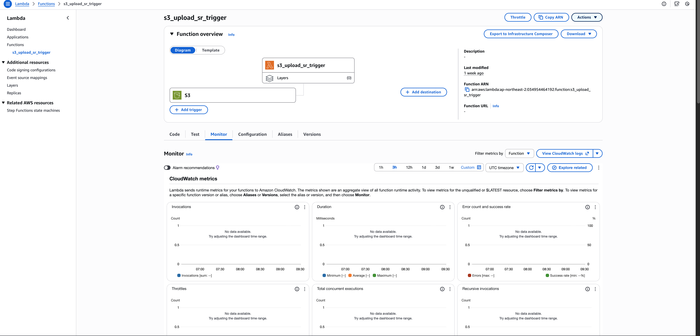
<br/>

### 3.Configuring the Step Function

Step Functions orchestrates the entire pipeline, which includes executing the SR process via SSM Run Command, monitoring its completion, and then triggering the MediaConvert job.

### 3-1. Setting Step Functions Permissions

Apply the following IAM role under
**Step Functions → State machine configuration → Permissions → Role ARN**:

```bash
arn:aws:iam::034954464192:role/service-role/s3_upload_trigger-role-03uddgtr
```

<br/>
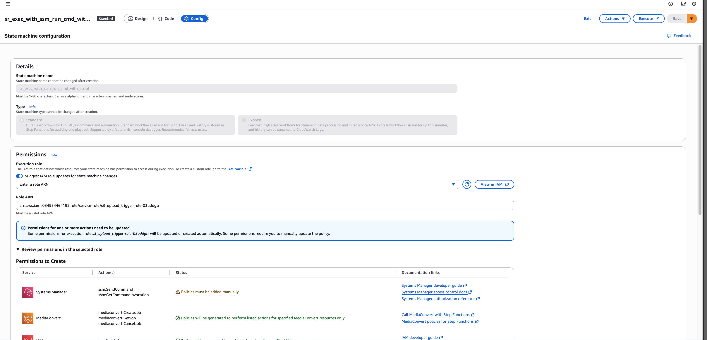
<br/>

### 3-2. Creating the Step Function

- **Step Functions → State machines → Create state machine**
- Authoring method: **Create from blank**
- Name: **sr_exec_with_ssm_run_cmd**
- Type: **Standard**

<br/>
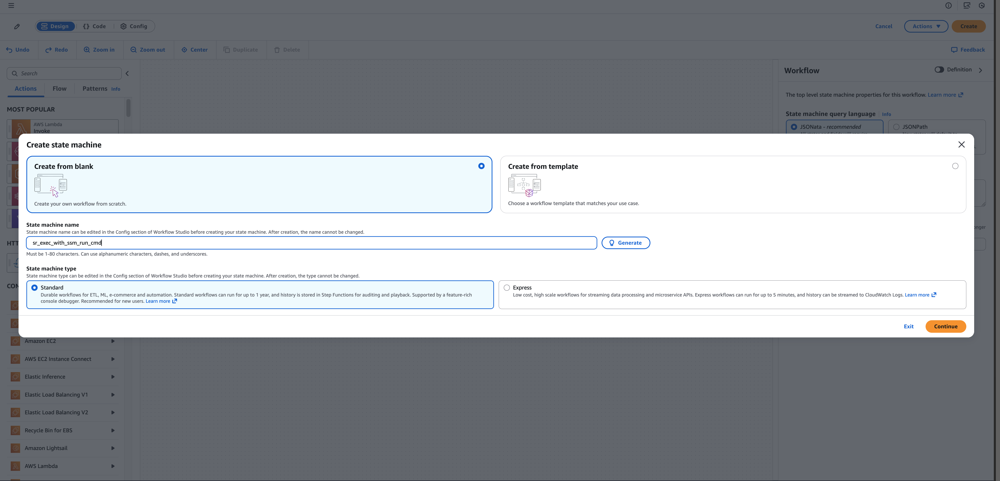
<br/>

### 3-3. Executing the Step Function

The following state machine automatically performs the entire workflow:

- Executes an SSM Run Command on the EC2 instance to run the FFmpeg-based SR process
- Polls the command status until the task is completed
- Upon successful completion, triggers a MediaConvert job to generate the HLS output

<br/>
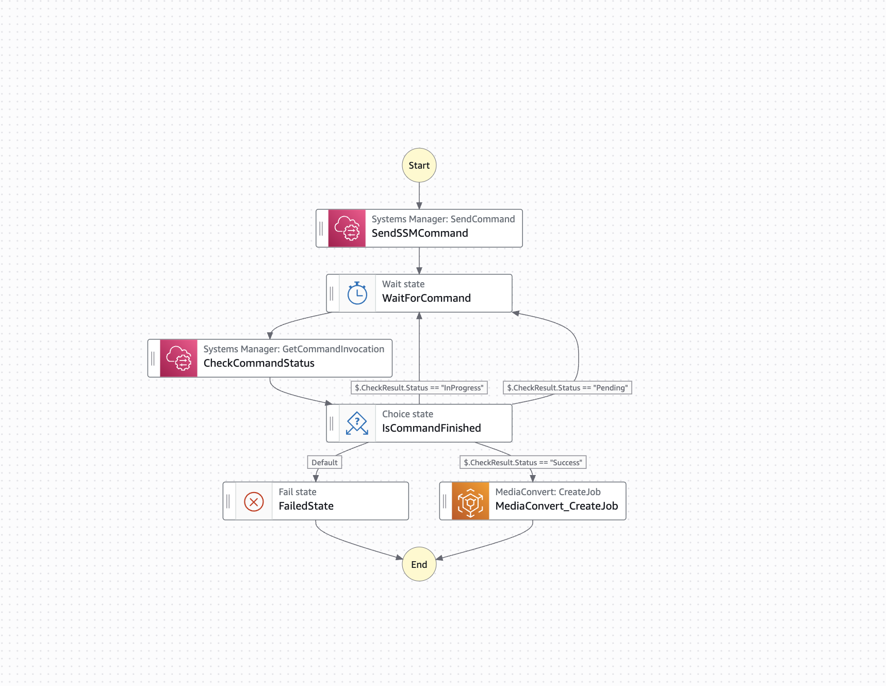
<br/>

```json
{
  "Comment": "Run SSM command from Step Functions",
  "StartAt": "SendSSMCommand",
  "States": {
    "SendSSMCommand": {
      "Type": "Task",
      "Resource": "arn:aws:states:::aws-sdk:ssm:sendCommand",
      "Parameters": {
        "InstanceIds.$": "States.Array(States.Format('{}', $.instanceId) )",
        "DocumentName": "AWS-RunShellScript",
        "Comment": "Run script from Step Functions",
        "Parameters": {
          "commands.$": "States.Array( States.Format('cd /root;./exec_bluewhale_sr.sh {} {} {} {}', $.origBucket, $.origFile, $.srBucket, $.srFile) )"
          }
        }
      },
      "ResultPath": "$.SendResult",
      "Next": "WaitForCommand"
    },
    "WaitForCommand": {
      "Type": "Wait",
      "Seconds": 5,
      "Next": "CheckCommandStatus"
    },
    "CheckCommandStatus": {
      "Type": "Task",
      "Resource": "arn:aws:states:::aws-sdk:ssm:getCommandInvocation",
      "Parameters": {
        "CommandId.$": "$.SendResult.Command.CommandId",
        "InstanceId.$": "$.instanceId"
      },
      "ResultPath": "$.CheckResult",
      "Next": "IsCommandFinished"
    },
    "IsCommandFinished": {
      "Type": "Choice",
      "Choices": [
        {
          "Variable": "$.CheckResult.Status",
          "StringEquals": "Success",
          "Next": "MediaConvert_CreateJob"
        },
        {
          "Variable": "$.CheckResult.Status",
          "StringEquals": "InProgress",
          "Next": "WaitForCommand"
        },
        {
          "Variable": "$.CheckResult.Status",
          "StringEquals": "Pending",
          "Next": "WaitForCommand"
        }
      ],
      "Default": "FailedState"
    },
    "FailedState": {
      "Type": "Fail",
      "Cause": "SSM Command failed or timed out"
    },
    "MediaConvert_CreateJob": {
      "Type": "Task",
      "Resource": "arn:aws:states:::mediaconvert:createJob.sync",
      "Parameters": {
        "Role": "arn:aws:iam::034954464192:role/MediaConvert_Default_Role",
        "Settings": {
          "TimecodeConfig": {
            "Source": "ZEROBASED"
          },
          "OutputGroups": [
            {
              "Name": "Apple HLS",
              "Outputs": [
                {
                  "ContainerSettings": {
                    "Container": "M3U8",
                    "M3u8Settings": {}
                  },
                  "VideoDescription": {
                    "CodecSettings": {
                      "Codec": "H_264",
                      "H264Settings": {
                        "MaxBitrate": 5000000,
                        "RateControlMode": "QVBR",
                        "SceneChangeDetect": "TRANSITION_DETECTION"
                      }
                    }
                  },
                  "AudioDescriptions": [
                    {
                      "CodecSettings": {
                        "Codec": "AAC",
                        "AacSettings": {
                          "Bitrate": 96000,
                          "CodingMode": "CODING_MODE_2_0",
                          "SampleRate": 48000
                        }
                      }
                    }
                  ],
                  "OutputSettings": {
                    "HlsSettings": {}
                  },
                  "NameModifier.$": "States.Format('_modifier_{}', $.srFile)"
                }
              ],
              "OutputGroupSettings": {
                "Type": "HLS_GROUP_SETTINGS",
                "HlsGroupSettings": {
                  "SegmentLength": 10,
                  "Destination.$": "States.Format('s3://{}/hls/{}/', $.srBucket, $.srFile)",
                  "DestinationSettings": {
                    "S3Settings": {
                      "StorageClass": "STANDARD"
                    }
                  },
                  "MinSegmentLength": 0
                }
              }
            }
          ],
          "FollowSource": 1,
          "Inputs": [
            {
              "AudioSelectors": {
                "Audio Selector 1": {
                  "DefaultSelection": "DEFAULT"
                }
              },
              "VideoSelector": {},
              "TimecodeSource": "ZEROBASED",
              "FileInput.$": "States.Format('s3://{}/{}', $.srBucket, $.srFile)"
            }
          ]
        }
      },
      "End": true
    }
  }
}
```

Step Functions’ `SendSSMCommand` state invokes the SR processing script (`exec_bluewhale_sr.sh`) on the Bluewhale AMI–based EC2 instance.
This script downloads the source file from S3, performs FFmpeg-based super-resolution (SR) processing, and uploads the resulting file back to S3.

Below is an example of the actual shell script used for SR processing, which is executed by Step Functions:

```bash
#!/bin/bash

if [ $# -ne 4 ];then
    echo "usage $0 [orig_bucket] [orig_filename] [sr_bucket] [sr_filename]";
    exit -1;
fi

### aws access_key
export AWS_ACCESS_KEY_ID=YOUR_ACCESS_KEY_ID
export AWS_SECRET_ACCESS_KEY=YOUR_SECRET_ACCESS_KEY
export AWS_DEFAULT_REGION=YOUR_REGION

### env for sr.
export ONNX_DIR=/usr/local/bluedot/models/
export LD_LIBRARY_PATH=/usr/local/cuda/lib64:/usr/local/bluedot/:/usr/local/TensorRT/lib:$LD_LIBRARY_PATH
export PATH=/usr/local/bluedot:$PATH

ORIG_BUCKET=$1
ORIG_FILENAME=$2
SR_BUCKET=$3
SR_FILENAME=$4

echo "* orig path : ${ORIG_BUCKET}/${ORIG_FILENAME}"
echo "* sr path   : ${SR_BUCKET}/${SR_FILENAME}"

cd /root;

### download original-file.
aws s3 cp s3://${ORIG_BUCKET}/${ORIG_FILENAME} ./${ORIG_FILENAME}

### do sr.
ffmpeg -y -i ${ORIG_FILENAME} -vf bdsr_aws=scale=2 -c:v h264_nvenc -cq 13 ${SR_FILENAME}

### upload sr-file.
aws s3 cp ./${SR_FILENAME} s3://${SR_BUCKET}/${SR_FILENAME}
```

### 3-4. Input Example

```json
{
  "instanceId": "i-0fc7eb64184f98251",
  "origBucket": "bluewhale-ami-sample",
  "origFile": "apink_10s.mp4",
  "srBucket": "bluewhale-ami-sample-sr",
  "srFile": "apink_10s_sr_2x.mp4"
}
```

| Variable Name | Description                                            |
| ------------- | ------------------------------------------------------ |
| instanceId    | EC2 instance where the SSM Run Command will execute    |
| origBucket    | S3 bucket containing the original source file          |
| origFile      | Name of the source file                                |
| srBucket      | S3 bucket where the SR-processed output will be stored |
| srFile SR     | Name of the generated SR output file                   |

### Step 4. End-to-End Testing

Upload a source file to the S3 bucket configured with the Lambda trigger

1. Lambda trigger is invoked automatically
2. The Step Functions workflow starts
3. FFmpeg-based SR processing runs on the EC2 instance
4. MediaConvert automatically generates the HLS output
5. Verify the final output files in the designated S3 destination
